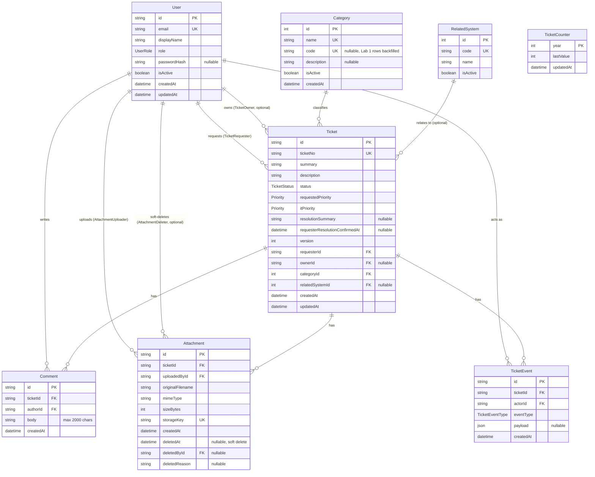

# Lab 2 Data Model

Issue #11 deliverable. Schema source of truth is `server/prisma/schema.prisma`; this file documents the shape and the reasoning behind it.

## ER diagram

`TicketCounter` has no foreign keys. It exists to generate `Ticket.ticketNo` (see below) and isn't part of the entity graph above.

## Enums

- `UserRole`: `REQUESTER`, `IT_STAFF`, `ADMINISTRATOR`.
- `TicketStatus`: `NEW`, `ASSIGNED`, `IN_PROGRESS`, `PENDING_REQUESTER`, `RESOLVED`, `CLOSED`, `CANCELLED`.
- `Priority`: `LOW`, `MEDIUM`, `HIGH`, `URGENT`. Used for both `requestedPriority` (set by the Requester) and `itPriority` (set by IT staff) on the same ticket.
- `TicketEventType`: `TICKET_CREATED`, `COMMENT_ADDED`, `ATTACHMENT_ADDED`, `ATTACHMENT_REMOVED`.

## Design notes

**Two priority fields, not one.** `requestedPriority` and `itPriority` live on the same `Ticket` row instead of being merged into a single field. The labsheet has the Requester's priority and IT's priority as separate concepts that can disagree, so collapsing them into one column would lose information the UI needs to show both values side by side.

**`ownerId` and `relatedSystemId` are nullable, `requesterId` and `categoryId` are not.** A ticket always has a requester and a category from the moment it's created (FR-01/FR-02), but it doesn't get an owner until someone in IT picks it up, and a related system is optional input on the creation form. All four use `onDelete: Restrict` so a user or category can't be deleted out from under a ticket that still references it.

**`Attachment` is soft-deleted, everything else is hard-deleted or immutable.** `deletedAt`/`deletedById`/`deletedReason` model the removal-with-reason flow from BR-09 without losing the audit trail of who uploaded what. `Comment` and `TicketEvent` rows are append-only once written, so they don't need a soft-delete column.

**`TicketEvent.payload` is a nullable JSON blob, not a fixed set of columns.** The four event types carry different data (a created event doesn't need the same fields as an attachment-removed event), and a generic audit log table doesn't need a rigid schema per event type. The `eventType` enum is what callers branch on; `payload` is read, not queried, so this doesn't cost an index.

**`Ticket.version` is a plain integer, not a Prisma `@updatedAt` alone.** `updatedAt` already tracks the last write time, but `version` exists so concurrent updates to the same ticket (two IT staff editing status at once) can use optimistic locking instead of last-write-wins.

**`ticketNo` is a separate unique string field, not the primary key.** The primary key (`id`) is a UUID so it's never guessable or sequential. `ticketNo` is the human-facing ticket number, generated per-year from `TicketCounter.lastValue`, and kept as its own unique column so the counter logic stays isolated from the primary key.

**`RelatedSystem` and `Category` are separate lookup tables, not a shared "tag" table.** They answer different questions on the creation form (what category is this request, what system does it relate to) and have independent lifecycles, so merging them would force one of the two to carry a discriminator column for no benefit.

## Migration and seed

- Migration: `server/prisma/migrations/20260818133426_lab2_ticketing_foundation/migration.sql`, applied on top of the Lab 1 baseline (`20260804092219_add_category`, which only had `Category`).
- `Category.code` and `Category.isActive` are added as nullable/defaulted columns so the four Lab 1 rows survive the migration without a manual backfill step, then the seed script backfills `code` for those four rows.
- Seed adds the ticketing users and related systems; it's idempotent (upsert by unique key), so re-running it doesn't duplicate the Lab 1 categories or create a second copy of the same user/system.
- Covered by `server/tests/lab-02/migration.test.ts` (Lab 1's four categories keep their data and get `code`/`isActive` backfilled correctly).
